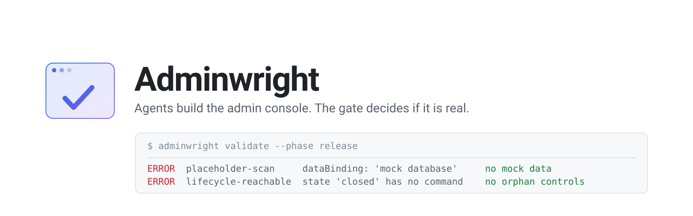

<picture>
  <source media="(prefers-color-scheme: dark)" srcset="assets/brand/banner-dark.svg">
  <source media="(prefers-color-scheme: light)" srcset="assets/brand/banner-light.svg">
  
</picture>

# Adminwright

**An Agent Skill that makes any coding agent build a real admin console — not a mock one.**

[](https://github.com/TarikAI/adminwright/actions/workflows/ci.yml)
[](LICENSE)
[](SKILL.md)

Ask an AI agent for an admin dashboard and you reliably get the same thing: a sidebar, four
KPI cards, one generic table, and buttons wired to `useState`. It looks finished. Nothing
behind it is real.

Adminwright replaces that with a process an agent can't fake its way through. It models the
platform's control plane in a manifest, then a validator refuses to call the work done until
every screen traces to a real server operation, a server-side policy, an authoritative data
source, an audit event, a test, and evidence that resolves on disk.

```
$ python scripts/admin_console_manifest.py validate --manifest .admin-console/manifest.json --phase release

ERROR: [placeholder-scan]  entities[user].sourceOfTruth: placeholder token 'mock' in 'mock database'
ERROR: [lifecycle-reachable] state 'closed' is the target of no command capability
ERROR: [evidence-not-resolvable] tests: no entry resolves to a non-empty local path
ERROR: [gate-evidence-path] evidence path does not exist: nonexistent/path.txt
```

## Why a manifest

Agents forget. Context gets compacted, sessions end, a second agent picks up work with no
memory of the first. `.admin-console/manifest.json` is the durable record of what this console
is supposed to be — every role, entity, lifecycle, capability, screen, integration, and quality
gate — and it is machine-checkable.

That turns "is the admin panel done?" from a judgement call into a command with an exit code.

## Quick start

Point your agent at [`SKILL.md`](SKILL.md). That's the whole integration — it routes to
everything else. Then, in your project:

```bash
python /path/to/adminwright/scripts/admin_console_manifest.py init \
  --project-root . --name "Your Platform" --archetype b2b-saas --profile standard
```

Use `py -3` or `python3` if `python` isn't on your PATH. Python 3.8+, standard library only —
no pip install, no dependencies, ever.

## Profiles: honest tiering

A gate nobody can pass gets faked. Three profiles scale strictness so a team can pass
**truthfully** at their tier instead of lying at the top one.

| Profile | For | Effect |
|---|---|---|
| `internal` | A small internal tool with named operators | Quality rules warn; accessibility and performance gates may be deferred with a recorded rationale |
| `standard` | Anything real users depend on | Evidence must resolve; all gates must pass |
| `regulated` | Money, health, minors, audited data | Adds test-token matching, separation of duties, privileged-read audit; forbids unresolved assumptions |

What never changes with profile: mock data, hardcoded values, and disconnected controls are
release-blocking at every tier.

## What it actually checks

Structural completeness, not vibes:

- Every role is used by at least one screen and one capability
- Every entity is observable by at least one query
- Every non-initial lifecycle state is reachable by a command
- Every capability links to a screen whose route it actually declares
- Every high-risk command has safeguards, recovery, and idempotency
- Every evidence path exists, is non-empty, and — at `regulated` — mentions the capability
- No placeholder anywhere in the release path

The placeholder scanner is deliberately hard to slip past. It folds Unicode homoglyphs
(`mоck` with a Cyrillic о), splits camelCase and snake_case, catches tokens with no case
boundary (`gmockRepositoryImpl`), recurses into nested arrays, and reads the *contents* of
evidence files — an evidence file reading "TODO: replace with real results" is a defect, not
proof. The one sanctioned exception is `declaredStatic[]`, where a genuinely static value is
registered with a reason and an approver.

## Multi-agent by design

Several agents can build one console concurrently. Coordination happens through the manifest
and lock files on disk — never through shared chat memory — so it works across harnesses, or
across machines on a shared checkout.

```bash
# take exclusive ownership; exit 3 means another agent holds it
... claim --agent impl-1 --role implementer --capability user.suspend
```

Five roles with defined boundaries: `architect`, `implementer`, `ux-reviewer`, `qa`,
`security`. One rule matters most — **the agent that implements a capability never marks it
reviewed.** A single agent runs the roles in sequence, re-reading the code rather than
recalling it.

The roles ship as ready-to-dispatch agents in [`agents/`](agents/) — the five above plus
`adminwright-harvester`, the learning pass that runs last on every mode. Claude Code loads
them from the plugin automatically; one command installs them into any other harness:

```bash
python scripts/install_agents.py --harness antigravity --project-root /path/to/project --append-pointer
```

Supported: `claude-code`, `opencode`, `codex`, `antigravity`, `gemini`, `cursor`, `pi`,
`generic`. The installer bakes the skill path into each prompt, writes the files where that
harness discovers agents, and adds harness-specific dispatch guidance — for Antigravity, for
example, that a user-supplied plan is the plan of record and must not be replaced by a
freshly generated one. See [agents/README.md](agents/README.md) for the dispatch order.

## It learns across your projects

Most skills are static. This one accumulates.

```
build project A ─┐
build project B ─┼─→ harvest ─→ ~/.adminwright/observations.jsonl ─→ promote ─→ lesson ─→ PR
build project C ─┘
```

`harvest` pulls a project's `feedback[]` into a store in your home directory, shared by every
project you work on. `promote` groups observations that say the same thing in different words
and surfaces only those that clear the bar: **seen on two or more distinct projects**, or a
correction of guidance that was factually wrong.

That bar is the point. One project's quirk belongs in that project's `AGENTS.md`. Only a
pattern that recurs across different platforms earns a place in the skill — which is what
stops it degrading into a pile of anecdotes.

```bash
... harvest --manifest .admin-console/manifest.json --date 2026-08-07
... promote                 # what has earned promotion, and why
```

**Across your devices.** `store init --remote <private-git-url>` makes the store a git
repository and `store sync` keeps every machine current. Observations merge by id union, not
by git's line merge, so two laptops that both appended never lose each other's work.

**Across people, opt-in.** `promote --export` writes a *sanitised* bundle — emails, URLs,
paths, hostnames, tokens replaced by markers; project names replaced by one-way fingerprints;
evidence references dropped. Contributing is a pull request, so review is the trust gate, and
contributed records can only ever *corroborate* — they never adopt guidance on their own.
Nothing leaves your machine unless you export it and choose to share it. See
[PRIVACY.md](PRIVACY.md).

Adoption is a judgement call and should be made by a capable model, not a cheap one — see
[references/skill-evolution.md](references/skill-evolution.md) for the promotion bar,
the never-promote list, and the "was it the skill or was it me?" test.

The `adminwright-harvester` agent automates the whole loop as the final pass of every run:
it sweeps the manifest, the worklogs, *and the session's conversation* for observations,
banks them, and — when the bar clears — edits the skill's references **and the agent
prompts themselves**. The agents are part of the write surface on purpose: a pass that
keeps skipping a step or a harness that fights the workflow is a defect in the role prompt,
and fixing it there is how the agents get better with every project instead of repeating
the same friction.

## Commands

```
init      scaffold .admin-console/manifest.json at a chosen profile
migrate   upgrade a v1 manifest to v2
validate  structure, evidence, placeholders, coverage        (0 clean / 1 findings / 2 usage)
coverage  structural gap audit on its own
emit      authz-matrix | test-plan | nav-map | seed-plan | operator-handbook | gap-report
add/set   safe partial writes under a lock (never rewrite the whole file)
claim     multi-agent capability ownership                    (3 = conflict)
harvest   move this project's feedback into the cross-project store
promote   list what clears the promotion bar; --export to share, --include-community to weigh
store     init | sync | status for the cross-device observation store
lesson    record and list durable lessons
```

`emit` is the quiet workhorse: the manifest already holds role × capability × scope, so the
permission matrix and the test plan are *generated*, not written by hand.

## Optional integrations

Two external tools plug in without ever becoming prerequisites:
[DesignArchitect](https://github.com/TarikAI/DesignArchitect) proves the UI complete at
Phase 4 (closure fixpoint, `holes_remaining: 0` as evidence), and
[Open Code Review](https://github.com/alibaba/open-code-review) adds a line-anchored
review pass whose findings persist as `gaps[]` — delegate mode needs no API key. Absent,
both change nothing. Full setup and usage: [INTEGRATIONS.md](INTEGRATIONS.md).

## What's in the box

```
SKILL.md                    the spine — phase-gated, routes to everything
INTEGRATIONS.md             optional DesignArchitect + Open Code Review wiring
agents/                     six dispatchable role agents (architect, implementer,
                            ux-reviewer, qa, security, harvester) + cross-harness docs
references/                 14 files: discovery, archetypes, architecture, security,
                            experience, verification, build order, stack adapters,
                            buy-vs-build, data model, multi-agent, test data, evolution
assets/admin-core-schema/   audit log, RBAC with scopes, impersonation, approvals,
                            jobs, exports, DSARs — Postgres + Prisma, Drizzle, Django,
                            Laravel, Rails
assets/adminwright-ocr-rules.json   admin-console review rules for the OCR pass
assets/agent-contract.template.md   drop into your repo as AGENTS.md / CLAUDE.md
scripts/                    the validator, the agent installer, and the optional
                            OCR bridge (stdlib only)
tests/                      regression tests, every one from a real defect
evals/                      golden fixtures pinning validator behaviour in CI
lessons/                    durable lessons, version-controlled and shared
```

`references/stack-adapters.md` is the one to read first if you're wiring this into an existing
codebase — it maps the abstract control plane onto the seven seams of Next.js, Laravel,
Django, Rails, NestJS, Supabase, Go, .NET, and commerce/CMS backends, and names the traps that
break admin consoles in each.

## Install

### Claude Code (recommended — stays up to date)

This repository is also a Claude Code plugin marketplace. Installing it this way makes the
skill available in every project on the machine, and Claude Code refreshes it in the
background as new commits land here:

```bash
claude plugin marketplace add TarikAI/adminwright
```

```bash
claude plugin install adminwright@tarikai
```

Then invoke it with `/adminwright:adminwright`, or just describe the admin work and let the
model reach for it. To force a refresh instead of waiting for the background one, run
`claude plugin marketplace update tarikai` followed by `claude plugin update adminwright`.

### Every other harness

Copy or clone this repository anywhere, then install the agents into your project:

```bash
python /path/to/adminwright/scripts/install_agents.py --harness <name> --project-root . --append-pointer
```

| Harness | Skill entry point | Agents land in |
|---|---|---|
| Claude Code / claude.ai (manual copy) | `~/.claude/skills/adminwright/` or the project's `.claude/skills/` | `.claude/agents/` |
| opencode | point the agent at `SKILL.md` | `.opencode/agent/` (as subagents) |
| OpenAI Codex | `.agents/skills/adminwright/`, referenced from `AGENTS.md` | `.adminwright/agents/` + `AGENTS.md` block |
| Google Antigravity | reference `SKILL.md` from `AGENTS.md` | `.adminwright/agents/` + `AGENTS.md` block |
| Gemini CLI | reference `SKILL.md` from `GEMINI.md` | `.adminwright/agents/` + `GEMINI.md` block |
| Cursor | point a rule at `SKILL.md` | `.adminwright/agents/` + `.cursorrules` block |
| Pi, anything else | point the agent at `SKILL.md` | `.adminwright/agents/` (harness `pi` or `generic`) |

Nothing here is vendor-specific. See [agents/README.md](agents/README.md).

## Contributing

Lessons from real builds are the most valuable contribution — see
[CONTRIBUTING.md](CONTRIBUTING.md). The bar for changing guidance is deliberately high, and
it's documented rather than a matter of taste.

```bash
python -m unittest discover -s tests -v   # regression tests
python evals/run.py                       # golden fixtures
```

The evals are the regression floor for guidance changes: one truthful platform that must pass
at every profile, one with deliberate defects that must each be caught. If a change flips a
fixture, either the change is wrong or the expectation was — decide which, and say so in the
commit.

## License

[Apache 2.0](LICENSE). Chosen over MIT for two reasons that matter to a project
agents will run inside other people's systems: it grants patent rights explicitly, and it
does not grant trademark rights — the code is yours to use, the name stays ours.
